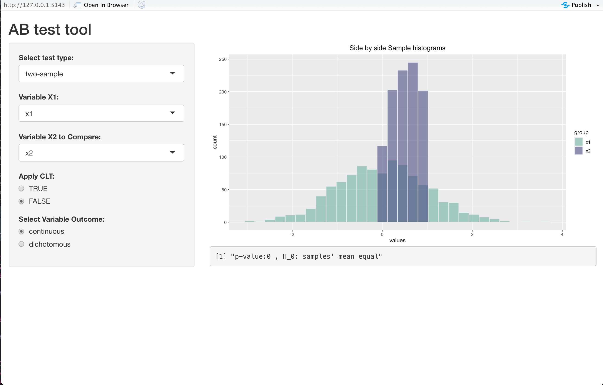

# abtest

abtest is an R package which enables one-sample & two sample AB testing for discrete or continuous variables. The main difference with the base R functions is the direct application of Central Limit Theorem.  


```
#create a sample from uniform distribution
x <- runif(1000)
hist(x,50)

#apply CLT 
x <- clt_transform(x)
hist(x,50)
```

Depending on the samples to be compared you can apply or not the CLT.

```
#two sample t-test 
x1 <- rnorm(1000)
x2 <- runif(1000)
t_test_two_sample(x1,x2,clt=T)
```

Functions have been merged into a shiny app. The user is able to perform a test for any of the variables loaded into the environment and interactively check results.

```
runshinyapp()
```


